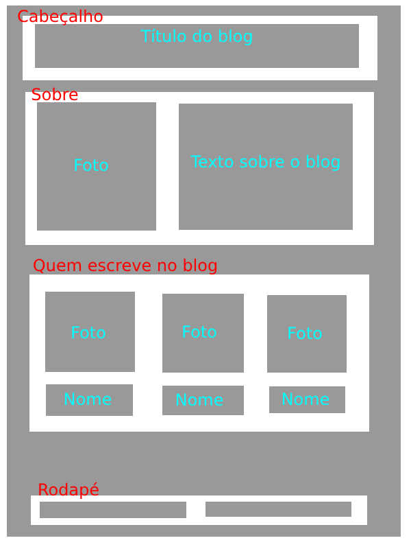

# Exercícios - HTML

## Adicionar um novo post no blog. 

Você vai precisar:

1. criar um novo arquivo html para o post (seguindo as convenções de nome de arquivo definidas)
1. escrever o código html do novo post (seguindo o padrão/estrutura de tags do post de exemplo)
1. acrescentar uma nova entrada (novo *article*) no index.html linkando para o novo post - essa entrada deve seguir o padrão da entrada de exemplo (a da lista de posts que fizemos, com título, data, imagem, etc.)

## Melhorar a página "about.html" do blog

A página "about.html" está bem vazia. Vamos melhorá-la.

Modelo da página "about.html"

A página about.html vai ter 4 seções:

- cabeçalho
- sobre
- quem escreve no blog
- rodapé

A parte principal da página é composta pelas seções *Sobre* e *Quem escreve no blog*. O cabeçalho e o rodapé são seções comuns a todas as páginas do site.

Sua tarefa é modelar o conteúdo dessa página usando as tags HTML que vimos até agora.

Faça a análise do conteúdo e escolha as tags que você achar mais adequadas. 