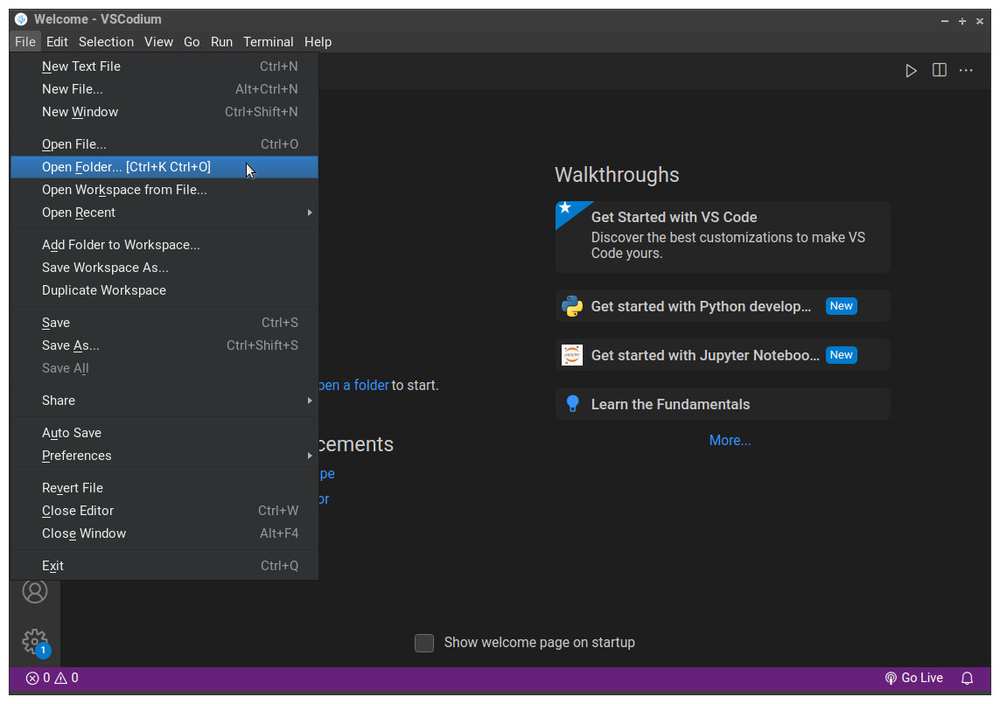
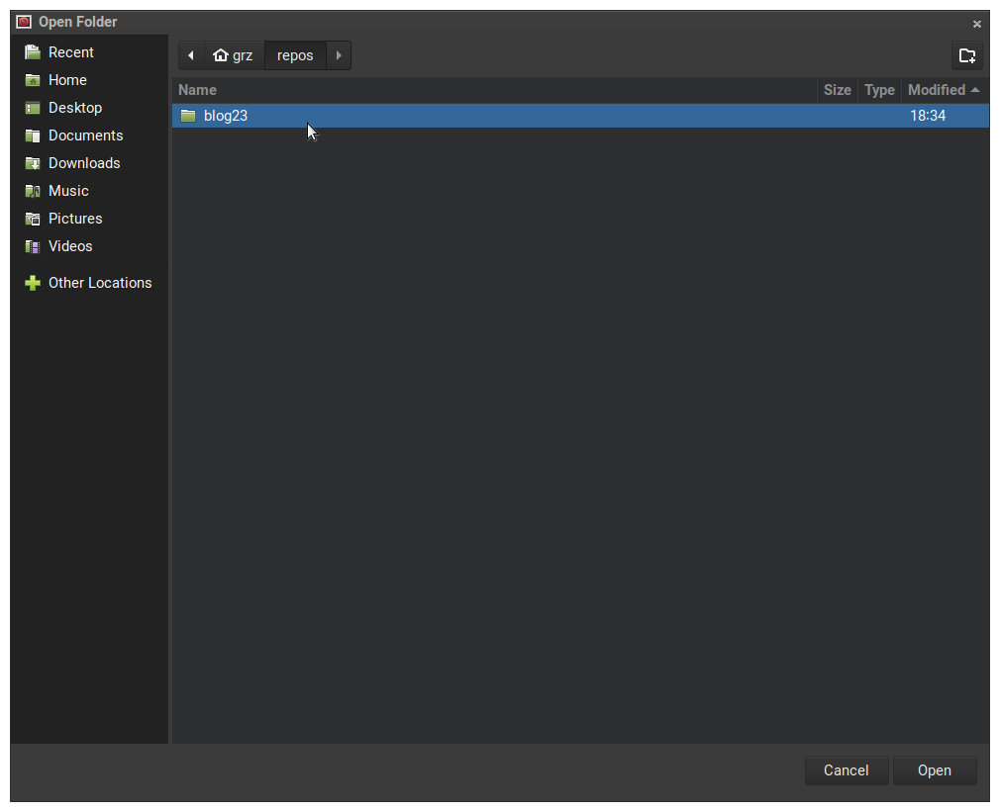
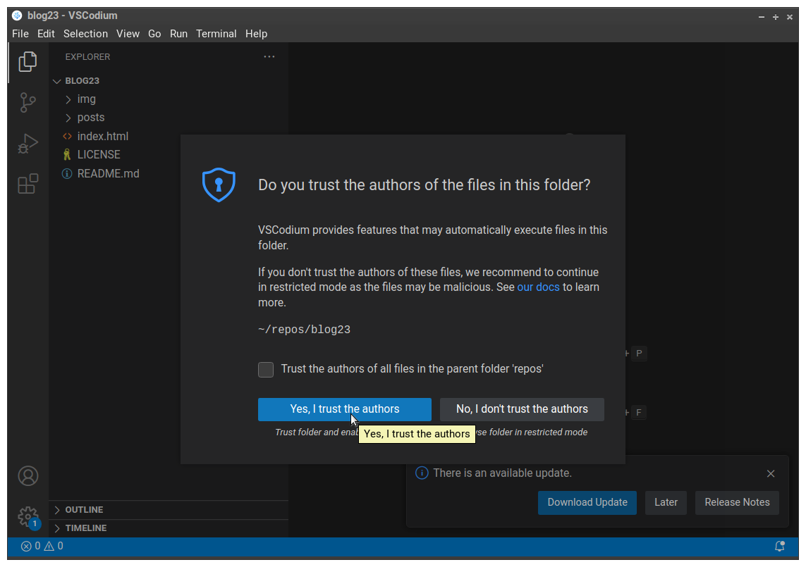
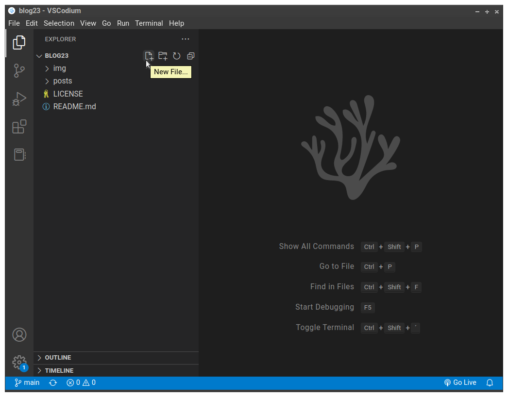
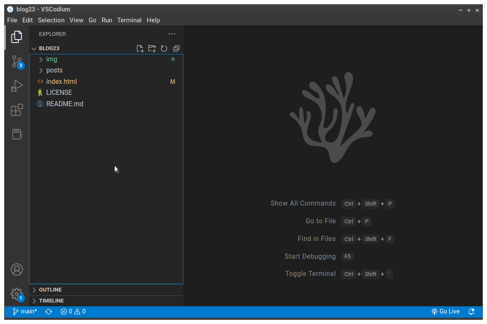
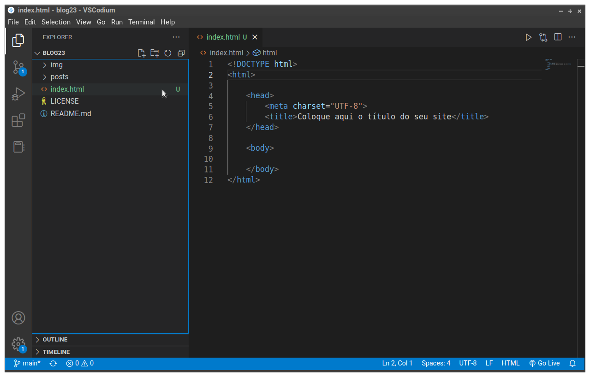

# Tarefa 1: Criar o arquivo <code>index.html</code>

Agora vamos começar a criar as páginas do site! 


## Abrir o diretório do seu projeto no VSCodium

Abra o diretório do seu projeto no VSCodium.

1. Vá no menu <kbd>File</kbd> (Arquivo)

2. Escolha a opção <kbd>Open Folder... [Ctrl+K Ctrl+O]</kbd>

<figure>

<figcaption style = "text-align: center">Comando para abrir um diretório (Folder) no VSCodium</figcaption>
</figure>

3. Na caixa de diálogo que se abrirá, vá até o diretório do seu projeto (se você não escolheu outro lugar, ele deve estar no seu diretório <code>home</code>, aquele que tem o nome do seu usuário, e dentro do diretório <code>repos</code> que criamos, e seu nome é <code>blog23</code>). Na figura abaixo você vê um exemplo no Linux

<figure>

<figcaption style = "text-align: center">Caixa de diálogo no Linux mostrando caminho para o diretório</figcaption>
</figure>

4. Clique no botão <kbd>Open</kbd> da caixa de diálogo para abrir esse diretório no VSCodium

5. Todas as vezes que você abrir um diretório no VSCodium pela primeira vez, ele vai mostrar uma tela de confirmação perguntando se você confia ou não nos autores dos arquivos que estão nesse diretório. Caso você não confie o VSCodium vai desligar várias funcionalidades dele, impedindo que o código seja executado, acesse seus discos entre outras coiasas. Isso é por questão de segurança. Por exemplo, você pode ter baixado os arquivos de um repositório de um desconhecido e só quer dar uma olhada, pra ver o que tem lá. Nesse caso escolha <kbd>No, I don't trust the authors</kbd> (Não, não confio nos autores). Como esse não é o caso, escolha a opção padrão, que está em azul: <kbd>Yes, I trust the authors</kbd> (Sim, confio nos autores).

<figure>

<figcaption style = "text-align: center">Diga que você confia nos autores dos arquivos deste diretório</figcaption>
</figure>

## Criar o arquivo da página principal

A página principal fica gravada no arquivo <code>index.html</code> que fica no diretório raíz do seu site/repositório.

1. Crie o arquivo <code>index.html</code> na raíz do seu repositório. Existem várias maneiras de fazer isso. Por exemplo, no painel à esquerda da tela, no lado direito do nome do diretório do projeto, você pode clicar em um botão de "criar arquivo" que aparece quando você leva o mouse até o lado direito do nome do diretório do projeto, como mostra a figura abaixo

<figure>

<figcaption style = "text-align: center">Botão de "criar novo arquivo"</figcaption>
</figure>

2. No painel da esquerda vai aparecer uma caixa de texto onde você deve digitar o nome do novo arquivo. Neste caso, digite <kbd>index.html</kbd> e tecle <kbd>Enter</kbd>


### Corrigindo um erro comum

Cuide para que o arquivo <code>index.html</code> tenha sido criado no diretório certo. Após criado, ele deve aparecer abaixo do diretório <code>posts</code> na listagem do painel à esquerda.

Caso ele não apareça lá, é porque ele ficou dentro de um dos outros diretórios. Nesse caso, apague o arquivo (selecionando ele e teclando a tecla <kbd>DEL</kbd>) e crie o arquivo novamente.

Desta vez, primeiro selecione o diretório raíz do seu projeto e depois depois refaça os passos 1 e 2.

Para selecionar o diretório raíz, clique na área indicada pelo mouse na figura abaixo.
<figure>

<figcaption style = "text-align: center">Selecionando o diretório raíz do projeto"</figcaption>
</figure>


## Escrever o código da página principal

1. Selecione o arquivo <code>index.html</code> (que está no painel da **esquerda**)
1. Copie e cole o modelo de HTML abaixo dentro do arquivo <code>index.html</code> (painel da **direita** do VSCodium)

``` HTML
<!--
Este é um modelo de arquivo HTML para você começar.
Ele tem o básico.

Estas TAGS que estão entre !-- e --
são comentários de código.
Você não precisa deixar elas no seu arquivo.
-->


<!-- Tag que indica que o código abaixo está
no padrão HTML 5-->

<!DOCTYPE html>

<!-- <html>  - raíz do documento HTML-->

<html>

    <!-- <head> Cabeçalho com informações sobre este
    documento HTML
    -->
    <head>
        <!-- A Tag abaixo indica que vamos usar caracteres
            UNICODE (UTF-8).
        Precisamos disso para ter acentuação no nosso texto.
        -->
        <meta charset="UTF-8">

        <!--Este é o título que aparece na aba do navegador
        quando a página é carregada-->    
        <title>Título do site ou nome da página</title>    
    </head>


  <!--Início da página HTML. O que estiver entre as tags
<body> </body> é o que o browser vai mostrar
quando carregar a página-->

    <body>
        Página principal
    </body>
</html>
```

Abaixo, por comodidade e para facilitar a leitura do código, está o HTML sem os comentários.

``` html
<!DOCTYPE html>

<html>

    <head>
        <meta charset="UTF-8">
        <title>Título do site ou nome da página</title>    
    </head>

    <body>
        Página principal
    </body>
</html>
```

Neste ponto a tela do seu VSCodium deve estar parecida com a da figura abaixo.

<figure>

<figcaption style = "text-align: center">VSCodium após criação do index.html</figcaption>
</figure>

A página principal não está pronta. Falta bastante coisa. Em particular, todos estes rascunhos que vamos fazer não terão nenhum estilo, apenas a aparência padrão deles, que é dada pelo próprio browser. 

Vamos continuar trabalhando esses rascunhos mais adiante, inclusive dando uma melhor aparência para eles usando CSS.