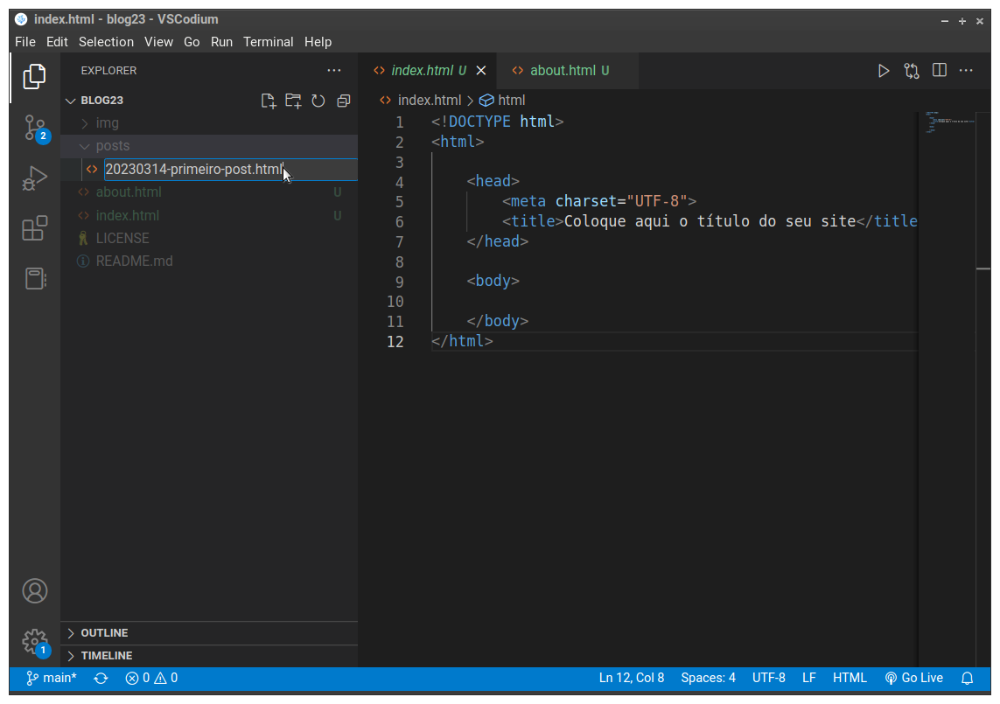

# Fazer uma "página de post"

Antes de fazer a listagem de artigos (que deve aparecer na página principal) e antes de fazer o menu do site (que deve aparecer em todas as páginas), vamos fazer um HTML com o conteúdo de um artigo do nosso blog.

Esta ainda não é a página completa, com tudo o que foi pedido (os requisitos da página). Vamos fazer assim porque esse é o último arquivo HTML que está faltando para termos um exemplo de cada tipo de página que nosso site terá. Deixaremos os demais requisitos para uma próxima etapa da construção do site.

Recordando, nosso site tem três tipos de página:

- página principal (index.html)
- sobre (about.html)
- artigos/posts

> Os artigos são vários arquivos html, mas todos com a mesma estrutura. **Por isso são todos do mesmo tipo**. Isso quer dizer que quando vistos no browser eles podem ter conteúdo diferente, mas a aparência e *a forma como o conteúdo está estruturado* são as mesmas.

## Passos

1. Crie um arquivo HTML no diretório <code>posts</code>. Ele deve seguir a regra de nomenclatura que foi pedida anteriormente. Neste exemplo, vamos criar o arquivo para um post cujo titulo é "Primeiro post" e que foi publicado no dia 14/03/2023. Observe na figura abaixo:

<figure>

<figcaption style = "text-align: center">Arquivo de post sendo criado no diretório <code>posts</code></figcaption>
</figure>

2. Copie o código abaixo para o arquivo de post recém criado.

``` html
<!DOCTYPE html>
<html>

    <head>
        <meta charset="UTF-8">
        <title>Primeiro post</title>    
    </head>

    <body>
    <!--
        Observe que esta tag é chamada 'header'
        e não 'head' como a que aparece acima.
        A tag HEAD só é usada uma vez em cada
        página.

        A tag HEADER é usada no corpo (body) da página
        e pode ser usada toda vez que tivemos um conteúdo
        que seja um cabeçalho. Pode ser o cabeçalho que
        aparece no topo da página (com nome, menus, etc...)
        ou o cabeçalho de um post ou qualquer outro caso.
    -->
        <header>
            <h1>Blog 2023</h1>
        </header>

    
        <article>
            <header>
    <!-- um cabeçalho de nível 2 é usado para o título
    -->
                <h2>Primeiro post</h2>
                
    <!--
        Este elemento 'time' é usado para indicar que
        este conteúdo significa "horário" ou "data" ou ambos.

        Observe que a data apresentada pode estar em um
        formato independente do formato armazenado no elemento.

        O formato que é apresentado na página é o que está
        entre as tags 'time'. O valor de data/hora guardado
        no elemento é o valor da propriedade 'datetime'.
    -->
                <time datetime="2023-03-14 19:00">
                    14 de março de 2023
                </time>

            </header>
            <p>
                Este é o super conteúdo do primeiro post
                do blog. 
            </p>
        </article>
        
    </body>
</html>
```

3. Salve seu trabalho. Prometo que esta é a última vez que eu vou colocar esse passo.

Abaixo está o código acima sem os comentários, por comodidade e para facilitar a leitura do HTML.

Você pode copiar este código para sua página de post ao invés do código anterior, se preferir não levar junto os comentários.

``` html
<!DOCTYPE html>
<html>

    <head>
        <meta charset="UTF-8">        
        <title>Primeiro post</title>    
    </head>

    <body>

        <header>
            <h1>Blog 2023</h1>
        </header>


        <article>
            <header>
                <h2>Primeiro post</h2>
                
                <time datetime="2023-03-14 19:00">
                    14 de março de 2023
                </time>

            </header>
            <p>
                Este é o super conteúdo do primeiro post
                do blog. 
            </p>
            <p>
                Lorem ipsum dolor sit amet, consectetur adipiscing elit, sed do eiusmod tempor incididunt ut labore et dolore magna aliqua. Ut enim ad minim veniam, quis nostrud exercitation ullamco laboris nisi ut aliquip ex ea commodo consequat. Duis aute irure dolor in reprehenderit in voluptate velit esse cillum dolore eu fugiat nulla pariatur. Excepteur sint occaecat cupidatat non proident, sunt in culpa qui officia deserunt mollit anim id est laborum.
            </p>
        </article>

    </body>
</html>
```

## URL para acessar uma página de posts no Servidor Web de desenvolvimento

A URL para acessar o site é, por padrão:

- [http://localhost:5500](http://localhost:5500)

As páginas de post, entretanto, não estão no diretório raíz do nosso servidor, mas em um sub-diretório, chamado <code>posts</code>. Por isso, precisamos incluir esse sub-diretório no caminho indicado pelo URL quando quisermos abir uma página que está nele.

Por exemplo, para abrir a página de post que acabamos de fazer, a URL fica assim:


- [http://localhost:5500/posts/20230314-primeiro-post.html](http://localhost:5500/posts/20230314-primeiro-post.html)

--- 
Pronto. Agora já temos um arquivo para cada tipo de página do site. Ainda não temos nenhuma imagem mas na próxima etapa de construção do site resolveremos isso.

Antes disso, vamos atualializar nosso repositório no Codeberg.
